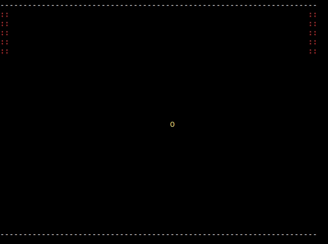

# Free Pong Game

A extended example of using Haskell Monad transformer RWST in combination with the Free monad.
Here, I implement a simple Pong Game which is interpreted in two ways:

- In the IO monad in order to play the game, getting the input commands from stdin and printing
the game snapshots on the terminal.  

- In a pure custom monad for testing purposes.

```haskell
newtype PongGame a = PongGame { runPG :: RWST Env (Seq Event) PongState (Free PongGameF) a }
  deriving 
    ( Functor
    , Applicative
    , Monad
    , MonadFree PongGameF
    )


type PureInterM a = WriterT (Seq PongState) (Except InvalidGame) a


game :: PongGame ()
game = 
  let go = do 
        unlessM checkGameTerminated $ do
          whenM checkGamePaused $ do waitForUnpauseCommand >>= handleCommand
          checkWallBounce
          checkPaddleBounce
          cmd <- getCommand 
          handleCommand cmd
          when (cmd == Tick) printGameSnapshot
          go
        printGameSnapshot
  in logEvent GameStarted >> go

```

## Usage

```bash
# 'w' -> MoveUpP1
# 's' -> MoveDownP1
# 'o' -> MoveUpP2
# 'l' -> MoveDownP2
# 'p' -> Pause
# 'q' -> Quit

# run and play  <windowWidth> <windowHeight> <paddleHeight> <fps> <logFile>
cabal run pong -- 70 25 5 60 "./pong.log"

# install and play
../pong/cabal install
../pong 70 25 5 60 "./pong.log" 

# run test suite
cabal test 

```

## Demo



## License
[MIT](https://choosealicense.com/licenses/mit/)

Made with <span style="color: #e25555;">&#9829;</span> in Málaga by José Velasco